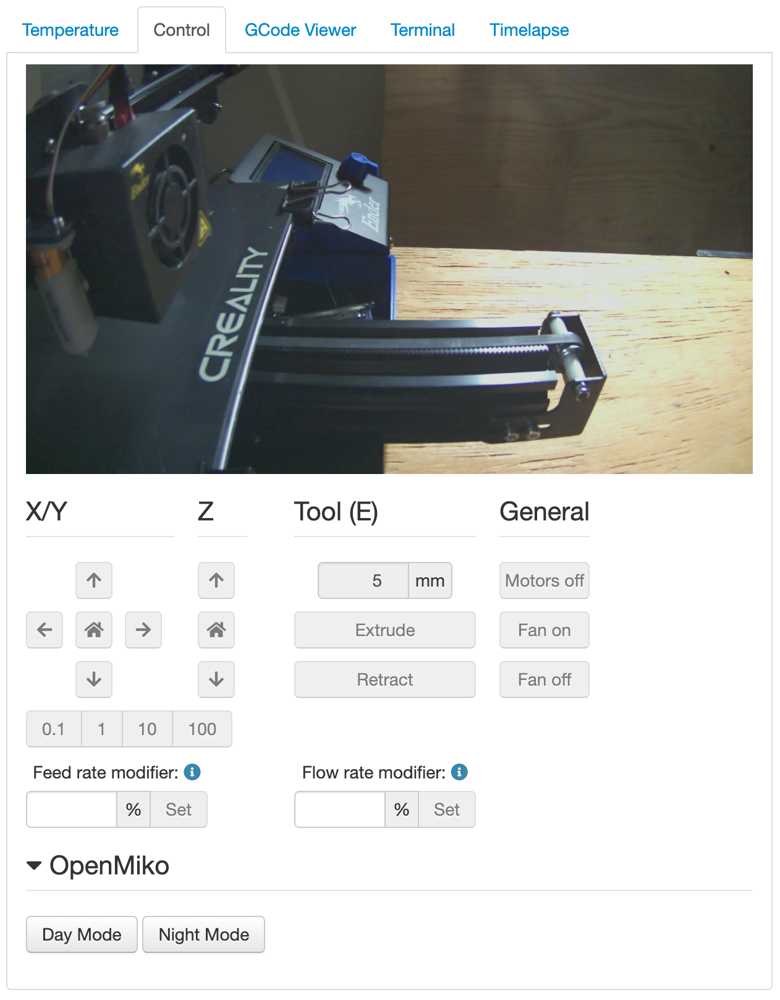

# OctoPrint-OpenMiko

This is a simple plugin that allows you to set the IR LED and IR cutoff filter values for [OpenMiko](https://github.com/openmiko/openmiko)-enabled webcams.

This plugin assumes that an OpenMiko-enabled camera has already been set up in OctoPrint as a webcam and will use the URL provided under the **Webcam & Timelapse** configuration within OctoPrint. If a webcam is not enabled, this plugin will not show any controls.

## Setup

Install via the bundled [Plugin Manager](https://docs.octoprint.org/en/master/bundledplugins/pluginmanager.html)
or manually using this URL:

    https://github.com/tmountjr/OctoPrint-OpenMiko/archive/main.zip

## Known Issues

* The OpenMiko firmware does not provide a CORS `Access-Control-Allow-Origin` header, which means that the necessary POST requests to the camera's API will cause errors in the console. However the calls still seem to work.

## Support

If you find a bug or incompatibility, please open an issue within GitHub.

If you like this plugin, that's great! I'm glad it's helpful and makes your life a little easier. If you _really_ want to go above and beyond, would you consider [buying me a coffee](https://www.buymeacoffee.com/tmountjr)? Most of my hobby development happens between the hours of 9pm and midnight and the extra caffeine goes a long way!
